# Mind Palace Pets - Comprehensive Improvements & Feature Roadmap

> **Project Context**: A 3D Mind Palace webapp with interactive companion pets  
> **Goal**: Add pets to the 3D Mind Palace space with enhanced user experience  
> **Analysis Date**: December 15, 2025

---

## 📁 Codebase Overview

| File             | Lines | Technology       | Theme      | Purpose                                                    |
| ---------------- | ----- | ---------------- | ---------- | ---------------------------------------------------------- |
| `index.html`     | 1,043 | Vanilla Three.js | Space      | Standalone demo - CDN-loaded, all-in-one HTML              |
| `GardenPets.jsx` | 2,169 | React + R3F      | Zen Garden | Full-featured with high-tier creatures (Tiger/Wolf/Dragon) |
| `SpacePets.jsx`  | 1,990 | React + R3F      | Space      | Base implementation with full pet AI system                |

### Architecture Highlights

```mermaid
graph TB
    subgraph "Pet System"
        A[Species Registry] --> B[Procedural Geometry]
        B --> C[Pet Component]
        C --> D[AI Brain State Machine]
        D --> E[Social Proxemics]
        E --> F[Heart Particle System]
    end

    subgraph "Rendering"
        G[Toon Shader Materials] --> H[SDF Eye Shader]
        H --> I[Instanced Geometry]
        I --> J[Blob Shadows]
    end

    subgraph "Interaction"
        K[Tap/Drag System] --> L[Petting Detection]
        L --> M[Love/Happiness Meter]
        M --> N[Visual Feedback]
    end
```



---

## 🔍 Current Strengths

1. **Mobile-First Design**: Reduced polygon counts, no real-time shadows, instanced geometry caching
2. **Rich Pet Behaviors**: 8 AI states (wandering, curious, socializing, resting, chasing, running, sleeping, held)
3. **Social Proxemics**: Pets greet each other, form cuddle piles, engage in chase sequences
4. **Procedural Assets**: No external models/textures required - everything generated in code
5. **Expressive Faces**: SDF-based eye shader with blink, happy, wide expressions + directional look
6. **Local Persistence**: Pet positions/states saved to localStorage

---

## ⚠️ Identified Improvement Areas

### 1. **Code Architecture Issues**

| Issue                    | Location                           | Impact                                                  |
| ------------------------ | ---------------------------------- | ------------------------------------------------------- |
| Massive monolithic files | All files > 1000 lines             | Hard to maintain, debug, extend                         |
| Duplicated code          | `GardenPets.jsx` & `SpacePets.jsx` | 70%+ identical logic, updates needed in multiple places |
| No TypeScript            | Entire codebase                    | Type safety missing, harder refactoring                 |
| No state management      | Pet state scattered                | Difficult to add features like pet inventory            |

### 2. **Performance Bottlenecks**

| Issue                      | Location                          | Solution                                             |
| -------------------------- | --------------------------------- | ---------------------------------------------------- |
| Matrix4 allocation in loop | Ear twitch animation (`useFrame`) | Pre-allocate and reuse                               |
| Repeated geometry creation | `getPetGeometries()`              | Already cached, but cache key could be more granular |
| No LOD system              | All pet rendering                 | Add distance-based detail reduction                  |
| Unoptimized social checks  | O(n²) every 30 frames             | Use spatial partitioning for large pet counts        |

### 3. **Missing Features for Mind Palace Integration**

| Feature                     | Description                                  | Priority |
| --------------------------- | -------------------------------------------- | -------- |
| Pet-Memory Attachment       | Pets associated with specific memories/items | HIGH     |
| Environment Awareness       | Pets interact with furniture/objects         | HIGH     |
| Customization System        | User can change pet appearance/accessories   | MEDIUM   |
| Pet Sounds/Audio            | Ambient purring, barks, meows                | MEDIUM   |
| Achievement/Progress System | Pets evolve based on user engagement         | MEDIUM   |
| Multi-Room Navigation       | Pets follow between Mind Palace rooms        | LOW      |

### 4. **UX/UI Improvements**

| Issue               | Current State                 | Improvement                                  |
| ------------------- | ----------------------------- | -------------------------------------------- |
| HUD cluttered       | Too much text, always visible | Collapsible, minimal mode, gestural hints    |
| No onboarding       | Users must read instructions  | Interactive tutorial, progressive disclosure |
| Limited feedback    | Hearts only                   | Sound effects, screen shake, haptics         |
| No pet selection UI | Tap spawns random             | Gallery picker with previews                 |

---

## 🚀 Phased Implementation Plan

---

## Phase 1: Code Refactoring & Foundation

**Objective**: Restructure codebase for maintainability and prepare for new features

### Master Prompt for Phase 1

```
Refactor the Mind Palace Pets codebase from monolithic files into a modular architecture:

1. Create a shared `pets-core/` directory with:
   - `species.js` - Species definitions and configurations
   - `geometry.js` - Procedural geometry generation with caching
   - `materials.js` - Toon materials and shader definitions
   - `ai/brain.js` - Pet AI state machine
   - `ai/social.js` - Social proxemics and interaction logic
   - `components/Pet.jsx` - Main pet component
   - `components/HeartPool.jsx` - Heart particle system
   - `hooks/usePetState.js` - Pet state management hook
   - `hooks/useToonTextures.js` - Procedural texture hooks

2. Create theme-specific wrappers:
   - `themes/SpaceTheme.jsx` - Space environment + colors
   - `themes/GardenTheme.jsx` - Zen garden environment + colors

3. Maintain backward compatibility with `index.html` standalone demo

4. Add JSDoc comments to all public functions

5. Performance: Pre-allocate reusable Matrix4/Vector3 objects outside loops
```

### Deliverables for Phase 1

- [x] **D1.1**: Modular file structure under `pets-core/`
- [x] **D1.2**: Shared `Pet` component working in both themes
- [x] **D1.3**: No visible behavioral changes (regression-free)
- [x] **D1.4**: Memory allocation reduced in animation loops
- [x] **D1.5**: Documentation comments on all exported functions

### Quality Test Criteria

| Test            | Expected Result                           | How to Verify                            |
| --------------- | ----------------------------------------- | ---------------------------------------- |
| Theme switching | Both themes render identically to current | Visual comparison screenshots            |
| Pet behaviors   | All 8 AI states function correctly        | Manually trigger each state              |
| Performance     | No new frame drops on mobile              | Chrome DevTools Performance tab          |
| localStorage    | Pets persist correctly                    | Add pets, refresh page, verify positions |

---

## Phase 2: Mind Palace Integration

**Objective**: Connect pets to Mind Palace memory system and environment

### Master Prompt for Phase 2

```
Integrate the pet system with the Mind Palace 3D environment:

1. **Environment Awareness**:
   - Pets pathfind around furniture (simple obstacle avoidance)
   - Pets can rest on rugs/cushions (not just random spots)
   - Pets react to room lighting changes

2. **Memory Attachment System**:
   - Associate pets with "memory nodes" in the palace
   - Pets can be assigned as "guardians" of specific memories
   - Visual connection line/aura when pet is near its memory
   - Pets exhibit "curious" behavior when new memories added

3. **Spatial Integration**:
   - Proper ground detection (not hardcoded Y values)
   - Pets cast blob shadows correctly on all surfaces
   - Camera collision awareness (pets don't clip through player)

4. **State Persistence**:
   - Extend localStorage schema to include:
     - petId -> memoryId association
     - Pet happiness/bond level
     - Pet activity history

5. **Events System**:
   - Emit custom events: 'pet:greet', 'pet:rest', 'pet:assignedToMemory'
   - React context for pet state access across components
```

### Deliverables for Phase 2

- [x] **D2.1**: Pets navigate around furniture without clipping
- [x] **D2.2**: "Assign to Memory" UI interaction
- [x] **D2.3**: Visual indicator when pet guards memory
- [x] **D2.4**: Pets rest on designated furniture surfaces
- [x] **D2.5**: Events dispatched for pet actions

### Quality Test Criteria

| Test               | Expected Result                    | How to Verify                         |
| ------------------ | ---------------------------------- | ------------------------------------- |
| Obstacle avoidance | Pets walk around tables/chairs     | Place furniture, observe pathfinding  |
| Memory assignment  | Pet shows connection to memory     | Use "Assign" button, verify visual    |
| Persistence        | Memory assignments survive refresh | Assign pet, reload, check association |
| Events             | Custom events fire correctly       | Add event listener in console         |

---

## Phase 3: Pet Customization & Gacha System

**Objective**: Allow users to personalize pets and discover new species

### Master Prompt for Phase 3

```
Implement a pet customization and discovery system:

1. **Customization Options**:
   - Body color picker (with preset palettes per species)
   - Accessory slots: hat, collar, wings (optional cosmetics)
   - Name editing with validation
   - Size scale (within species limits)

2. **Gacha/Discovery System**:
   - "Summon Pet" button with animated reveal
   - Rarity tiers: Common (Cat/Dog/Bunny), Rare (Tiger/Wolf), Legendary (Dragon)
   - Probability weights: 70% Common, 25% Rare, 5% Legendary
   - First-time guarantee: At least one rare in first 3 summons

3. **UI Components**:
   - Pet Gallery modal showing all owned pets
   - Pet Detail card with stats, customization, actions
   - "Release Pet" option with confirmation
   - Pet sorting/filtering (by species, rarity, name)

4. **Procedural Accessories**:
   - Generate accessory geometry programmatically
   - Hat: cone/cylinder variations
   - Collar: torus with tag
   - Wings: plane geometry with vertex animation

5. **Save System Extension**:
   - Store customization in pet object
   - Export/import pet data as JSON
```

### Deliverables for Phase 3

- [x] **D3.1**: Color picker UI with real-time preview
- [ ] **D3.2**: 3 accessory types rendered on pets _(module created, integration pending)_
- [x] **D3.3**: Gacha summon animation and result display
- [ ] **D3.4**: Pet gallery with grid view
- [ ] **D3.5**: Export pet collection to JSON file

### Quality Test Criteria

| Test                | Expected Result                   | How to Verify                       |
| ------------------- | --------------------------------- | ----------------------------------- |
| Color change        | Pet updates immediately           | Change color, observe in scene      |
| Accessories         | Items render at correct positions | Equip hat, collar, verify placement |
| Gacha probabilities | Rarity distribution matches spec  | Summon 100 pets, tally results      |
| Export/Import       | Data round-trips correctly        | Export, delete pets, import, verify |

---

## Phase 4: Enhanced Interactions & Audio

**Objective**: Deepen emotional connection through richer feedback

### Master Prompt for Phase 4

```
Enhance pet interactions with audio and haptic feedback:

1. **Audio System**:
   - Implement Web Audio API integration
   - Per-species ambient sounds:
     - Cat: purr (when petted), meow (random/attention)
     - Dog: panting (wandering), bark (alert/happy)
     - Bunny: nose wiggle sound (soft ambient)
     - Dragon: rumble/hum (flying)
   - Spatial audio: sounds come from pet position
   - Master volume control + mute toggle

2. **Haptic Feedback** (Mobile):
   - Light vibration on pet tap
   - Pattern vibration on love meter fill
   - Use Navigator.vibrate API with fallback

3. **Enhanced Visual Feedback**:
   - Screen edge glow when pet nearby
   - Subtle camera shake on dramatic actions
   - Particle trails for running pets
   - Sleep "Z" particles for sleeping pets

4. **Gesture Recognition**:
   - Distinguish between tap, drag, and swipe
   - Swipe patterns trigger pet tricks:
     - Circle swipe = spin trick
     - Up-down = jump trick
     - Side-to-side = already implemented petting

5. **Sound Generation** (No external files):
   - Use OscillatorNode for synthesized sounds
   - Or use tiny base64-encoded audio snippets
```

### Deliverables for Phase 4

- [ ] **D4.1**: Audio system with volume controls
- [ ] **D4.2**: At least 2 sounds per base species
- [ ] **D4.3**: Haptic feedback on mobile interactions
- [ ] **D4.4**: "Sleep Z" and "running trail" particles
- [ ] **D4.5**: At least 2 gesture-triggered tricks

### Quality Test Criteria

| Test           | Expected Result            | How to Verify                      |
| -------------- | -------------------------- | ---------------------------------- |
| Audio playback | Sounds play without errors | Pet a cat, hear purr               |
| Spatial audio  | Sound moves with pet       | Walk around pet, verify 3D audio   |
| Haptics        | Phone vibrates on tap      | Test on physical mobile device     |
| Gestures       | Tricks trigger correctly   | Perform circle swipe, observe spin |

---

## Phase 5: Advanced AI & Companion System

**Objective**: Create deeper pet personalities and utility

### Master Prompt for Phase 5

```
Upgrade pet AI to provide meaningful companion functionality:

1. **Personality Traits**:
   - Each pet gets 3 personality values (0-1 scale):
     - Playfulness: affects chase frequency, trick enthusiasm
     - Curiosity: affects memory interaction, exploration range
     - Affection: affects player following, social behavior
   - Traits influenced by user interaction history

2. **Memory Companion Features**:
   - "Recall Pet" finds and highlights associated memory
   - Pet "presentation mode": pet guides to memory locations
   - Pop-up tooltip when hovering pet's memory

3. **Learning System**:
   - Pets remember player's common path
   - Pets wait at frequently visited spots
   - XP system: interactions increase pet bond level
   - Bond levels unlock behaviors/accessories

4. **Smart Behaviors**:
   - "Attention" state when user idle too long
   - Pets point/look at unvisited memories
   - Celebration animations for achievements

5. **Companion UI**:
   - Bond meter visualization
   - Personality radar chart
   - Activity log of pet interactions
```

### Deliverables for Phase 5

- [ ] **D5.1**: 3 personality traits per pet
- [ ] **D5.2**: "Find My Memory" feature functional
- [ ] **D5.3**: XP/Bond progression system
- [ ] **D5.4**: Pet attention-seeking when idle
- [ ] **D5.5**: Bond meter in pet detail UI

### Quality Test Criteria

| Test                | Expected Result                 | How to Verify                          |
| ------------------- | ------------------------------- | -------------------------------------- |
| Personality effects | High playfulness = more chasing | Create high-play pet, observe behavior |
| Memory finding      | Pet leads to correct memory     | Use "Find" button, follow pet          |
| Bond progression    | XP increases with interactions  | Pet repeatedly, check bond increase    |
| Idle attention      | Pet approaches after 30s idle   | Stand still, wait for pet response     |

---

## Phase 6: Polish & Performance Optimization

**Objective**: Production-ready quality and performance

### Master Prompt for Phase 6

```
Final optimization and polish pass:

1. **Performance**:
   - Implement LOD (Level of Detail) for pets
     - Near (< 5m): Full detail, all animations
     - Mid (5-15m): Reduced geometry, simplified ears
     - Far (> 15m): Billboard sprite or hidden
   - Object pooling for particles
   - RequestIdleCallback for non-critical updates
   - Lazy load pet geometry until first spawn

2. **Accessibility**:
   - Screen reader announcements for pet actions
   - Reduced motion mode (minimize bouncing/particles)
   - High contrast mode for HUD
   - Keyboard navigation for pet selection

3. **Error Handling**:
   - WebGL context lost recovery
   - localStorage quota exceeded handling
   - Graceful degradation on low-end devices

4. **Visual Polish**:
   - Smooth fade-in when pet spawns
   - Anti-aliased edges on toon shading
   - Consistent shadow sizing
   - Loading states for async operations

5. **Testing & Documentation**:
   - Unit tests for pet state machine
   - Integration tests for persistence
   - User documentation / help system
   - Performance benchmarks documented
```

### Deliverables for Phase 6

- [ ] **D6.1**: LOD system reducing draw calls at distance
- [ ] **D6.2**: Accessibility audit passed
- [ ] **D6.3**: Error recovery for all failure modes
- [ ] **D6.4**: Consistent spawn/despawn animations
- [ ] **D6.5**: Test suite with 80%+ coverage on core logic

### Quality Test Criteria

| Test                 | Expected Result                  | How to Verify                          |
| -------------------- | -------------------------------- | -------------------------------------- |
| 15+ pets performance | Maintain 30fps on mid-tier phone | Spawn 15 pets, measure FPS             |
| LOD activation       | Geometry simplifies at distance  | Zoom out, inspect draw calls           |
| Context loss         | Scene recovers automatically     | Force context loss (DevTools), observe |
| Accessibility        | Screen reader announces actions  | Enable VoiceOver/NVDA, test            |

---

## 📊 Implementation Priority Matrix

```
                    IMPACT
                    HIGH
                     │
      ┌──────────────┼──────────────┐
      │  Phase 2     │  Phase 1     │
      │  (Memory     │  (Refactor)  │
      │   Integration│              │
      │              │              │
 LOW ─┼──────────────┼──────────────┼─ HIGH
EFFORT│  Phase 4     │  Phase 3     │
      │  (Audio)     │  (Custom)    │
      │              │              │
      │  Phase 5     │  Phase 6     │
      │  (AI)        │  (Polish)    │
      └──────────────┼──────────────┘
                     │
                    LOW
```

**Recommended Order**: 1 → 2 → 3 → 4 → 5 → 6

---

## 🧪 Testing Strategy

### Automated Tests

```bash
# Unit tests for pet AI (after Phase 1)
npm test -- --grep "PetBrain"

# Integration tests for persistence
npm test -- --grep "LocalStorage"

# Visual regression (requires Playwright)
npx playwright test visual.spec.ts
```

### Manual Testing Checklist

Every phase should verify:

- [ ] Mobile Chrome (Android) - touch interactions work
- [ ] Mobile Safari (iOS) - no WebGL issues
- [ ] Desktop Chrome - pointer lock, keyboard controls
- [ ] Desktop Firefox - shader compatibility
- [ ] Low-memory simulation (Chrome DevTools)
- [ ] Slow CPU simulation (4x slowdown)

---

## 📝 Notes for Implementation

1. **Start simple**: Phase 1 refactoring is foundational - don't skip it
2. **Test mobile early**: Many issues only appear on real devices
3. **Profile regularly**: Use Chrome DevTools Performance tab
4. **Keep demos working**: `index.html` should remain functional throughout
5. **Version control**: Create branches for each phase
6. **User feedback**: After Phase 2-3, gather actual user input

---

_Document created by codebase analysis. Update as implementation progresses._
